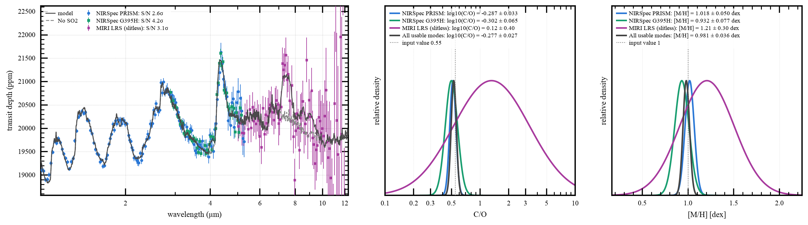

# JWST Transit Authority

JWST Transit Authority is a planning tool for JWST observations. The goal is to understand, for a given
science goal, the relative information that different JWST modes give you. The tool combines:

- VULCAN-JAX photochemical kinetics;
- ExoJAX transmission or thermal-emission spectra; and
- STScI Pandeia instrument signal and noise.

The tool ranks supported modes and estimates the number of transits or
eclipses needed (e.g. to detect SO2 at a certain confidence). It also provides conditional
template signal-to-noise values and local Fisher forecasts.

In particular, I've focused on making the forward model (photochemistry and radiative transfer) auto-differentiable. This is hugely helpful because the gradients and the Jacobians can be calculated quickly. Also, by hosting this online,
users can test ideas quickly instead of downloading 10s of GBs of data.

Try the [public web app](https://huggingface.co/spaces/imalsky/jwst-transit-authority), or
install the package for local runs. The Python package imports as `jwst_tool`. If you find bugs,
note them here on GitHub or email me please.

## Example



This is the tool's default case: detect SO2 on WASP-39 b in transmission,
with one transit per mode. Left: the VULCAN x ExoJAX model, the same model
with SO2 removed from the opacity (the chemistry is not re-solved), and one
seeded mock realization per mode; each legend entry
carries that mode's conditional template S/N for SO2. Right: per-mode
marginalized Fisher constraints on C/O and [M/H], drawn recentered on the
same noise draw. These are linearized forecasts, not sampled posteriors.

To make this figure, open the web app, keep the defaults, and press Run.

## Install (don't)

This can be run locally, but I really want the main tool to be the online version.
Locally, Python 3.10 or later is required. Pandeia runs in a separate Python 3.12
environment so that its dependencies do not change the forward-model
environment.

```bash
python -m pip install \
  -i https://test.pypi.org/simple/ \
  --extra-index-url https://pypi.org/simple/ \
  "jwst-transit-authority[gui]"

conda create -n pandeia_2026_7 python=3.12
conda run -n pandeia_2026_7 pip install pandeia.engine==2026.7
```

Set the data and output paths:

```bash
export JWST_TOOL_DATA_DIR="$HOME/vulcan/jwst-data"
export JWST_TOOL_OUTPUT_DIR="$HOME/vulcan/jwst-output"
export JWST_TOOL_PANDEIA_PYTHON="/path/to/pandeia_2026_7/bin/python"
export VULCAN_FORWARD_DATA="$HOME/vulcan/forward-data"
```

Fetch the available reference data and check the installation:

```bash
jwst-tool fetch
python -m vulcan_forward.fetch_exomolop \
  --molecules H2O,CO2,CO,CH4,SO2,C2H2,C2H4,H2S,HCN,NH3,OCS,SO,SH
jwst-tool data
```

`jwst-tool fetch` prints instructions for STScI files that need a manual
download. Pandeia engine, reference-data, and PSF releases must match.

## Run

```bash
jwst-tool
```

This starts the Streamlit app. The first model can take several minutes.
Later runs can use cached chemistry, spectra, and noise calculations.

The tool includes fixed configurations for selected NIRSpec, NIRISS SOSS,
NIRCam grism, and MIRI LRS modes. It supports transmission and eclipse
planning. Custom targets must stay within the model and opacity ranges shown
in the app.

## How to interpret the result

Use the rankings for exploration and mode comparison. Before a proposal,
confirm the final setup, saturation limits, groups, subarray, and timing in
the current JWST ETC and APT.

- Detection scores are conditional template signal-to-noise values. They are
  not retrieval significances.
- Fisher intervals are local, linear estimates under the selected atmosphere
  and noise assumptions. By this, I mean that it is local around the specific forward model that
  was run, and shouldn't be considered global behavior for different input parameters that can
  change the resulting atmosphere a lot.
- The default covariance treats spectral bins as independent. It does not model
  time-correlated systematics, stellar heterogeneity, or visit-long trends.
- A noise floor can be added, but one fixed floor cannot represent every
  target, mode, and reduction method.
- The comparison curve is the same model with the target species removed from
  the OPACITY. The chemistry is not re-solved, so the T-P profile, mean
  molecular weight, gravity, continuum, and every other species are unchanged.
- Eclipse depths use a single planet radius (the emission photosphere near
  0.1 bar), not the wavelength-dependent tau = 2/3 radius. Fortney et al.
  (2019) put the resulting eclipse-depth error at 10-25% for a hot Jupiter,
  wavelength-dependent and largest in the deepest bands.
- The depth uncertainty counts all of T14 as full depth (a box transit). For a
  typical hot Jupiter that is optimistic by roughly 5% in sigma, partly offset
  by the conservatism of the symmetric in/out variance term.
- Models and cached outputs are evidence, not observational ground truth.

## Validation

The test suite covers instrument configuration, binning, noise scaling,
detection statistics, Fisher calculations, and full transmission and emission
chains (the full-chain tests need the reference data and `JWST_TOOL_RUN_SLOW=1`). Pandeia results are compared with PandExo in
[`validation/parity/`](validation/parity/). The engine and science checks are
committed figures with the code that makes them in
[`validation/`](validation/) (`python validation/scripts/make_figures.py`
regenerates all of them; every PNG embeds the script that made it):

- [Radiative transfer vs petitRADTRANS](validation/figures/rt_verification_vs_petitradtrans.png) and [six atmospheres](validation/figures/rt_verification_six_atmospheres.png)
- [Power-law cloud deck vs petitRADTRANS](validation/figures/cloud_verification_vs_petitradtrans.png)
- [Correlated-k reader vs ExoJAX and exo_k](validation/figures/ckd_verification_vs_exojax_exok.png)
- [Chemistry: VULCAN 2.0 vs VULCAN 3.0 (JAX)](validation/figures/chemistry_w39b_vulcan2_vs_vulcan3.png)
- [WASP-39 b vs the ERS CO2 model grid](validation/figures/wasp39b_ers2023_co2_models.png) and [vs Tsai et al. 2023](validation/figures/wasp39b_tsai2023_metallicity_so2.png)
- [Observed spectra](validation/figures/observed_spectra_v30.png)

```bash
python -m pip install -e ".[gui,dev]" pytest
python -m pytest tests -q
```

## Papers and citation

Use [`CITATION.cff`](CITATION.cff) to cite this software. Also cite the parts
used in the analysis:

- VULCAN: [Tsai et al. (2017)](https://doi.org/10.3847/1538-4365/228/2/20)
  and [Tsai et al. (2021)](https://doi.org/10.3847/1538-4357/ac29bc)
- ExoJAX: [Kawahara et al. (2022)](https://arxiv.org/abs/2105.14782) and
  [Kawahara et al. (2025)](https://doi.org/10.3847/1538-4357/adcba2)
- Pandeia: [Pontoppidan et al. (2016)](https://doi.org/10.1117/12.2231768)
- PandExo comparison: [Batalha et al. (2017)](https://doi.org/10.1088/1538-3873/aa65b0)
- ExoMolOP tables: [Chubb et al. (2021)](https://doi.org/10.1051/0004-6361/202038350)
- FastChem initialization: [Stock et al. (2018)](https://doi.org/10.1093/mnras/sty1531)

Record the software commits, Pandeia release, reference-data release, opacity
data, reaction network, and model settings with any published result.

## Support and license

Open a [GitHub issue](https://github.com/imalsky/jwst-transit-authority/issues) and
include the exported configuration, versions, and full error message.

JWST Transit Authority is released under GPLv3.
